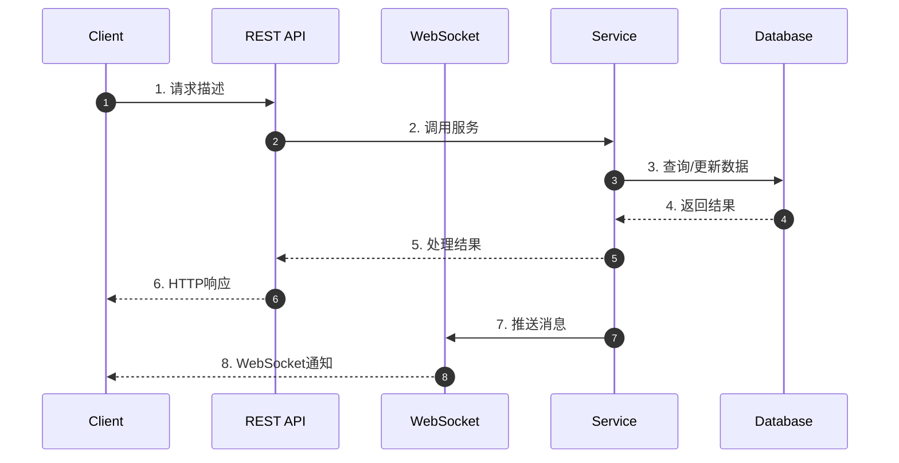
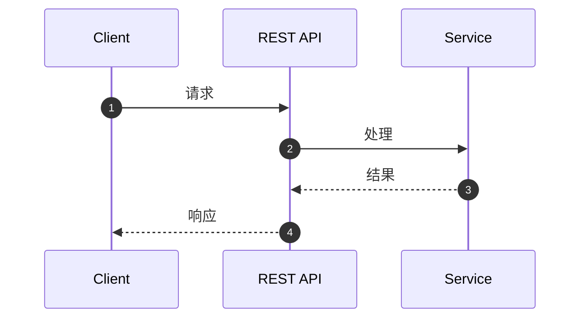

# 【模块名称】使用说明

> 文档版本：1.0  
> 作者：[作者名]  
> 创建日期：[YYYY-MM-DD]  
> 最后更新：[YYYY-MM-DD]

---

## 1. 功能概述

### 1.1 功能简介

简要描述该模块的功能和用途。

### 1.2 适用场景

- 场景1：...
- 场景2：...

### 1.3 相关术语

| 术语  | 说明  |
|-----|-----|
| 术语1 | 说明1 |
| 术语2 | 说明2 |

---

## 2. 架构设计

### 2.1 核心组件

```
┌─────────────────────────────────────────────────────────────┐
│                        【模块名称】                           │
├─────────────────────────────────────────────────────────────┤
│  ┌──────────────┐  ┌──────────────┐  ┌──────────────┐      │
│  │   组件1      │  │   组件2      │  │   组件3      │      │
│  │  Component1  │  │  Component2  │  │  Component3  │      │
│  └──────────────┘  └──────────────┘  └──────────────┘      │
└─────────────────────────────────────────────────────────────┘
```

### 2.2 核心类说明

| 类名     | 职责  | 关键方法                 |
|--------|-----|----------------------|
| Class1 | 职责1 | method1(), method2() |
| Class2 | 职责2 | method3(), method4() |

---

## 3. 接口说明

### 3.1 REST API

#### 接口1：接口名称

- **URL**: `/api/path`
- **Method**: `GET/POST/PUT/DELETE`
- **Content-Type**: `application/json`

**请求参数**：

| 参数名    | 类型     | 必填 | 说明    |
|--------|--------|----|-------|
| param1 | String | 是  | 参数1说明 |
| param2 | Long   | 否  | 参数2说明 |

**请求示例**：

```json
{
  "param1": "value1",
  "param2": 123
}
```

**响应参数**：

| 参数名     | 类型     | 说明   |
|---------|--------|------|
| code    | String | 响应码  |
| message | String | 响应消息 |
| data    | Object | 响应数据 |

**响应示例**：

```json
{
  "code": "SUCCESS",
  "message": "操作成功",
  "data": {
    "key": "value"
  }
}
```

**错误码**：

| 错误码          | 说明    | HTTP状态码 |
|--------------|-------|---------|
| ERROR_CODE_1 | 错误说明1 | 400     |
| ERROR_CODE_2 | 错误说明2 | 403     |

### 3.2 WebSocket 消息

#### 消息类型1：消息名称

- **Type**: `MESSAGE_TYPE`
- **Direction**: `Server -> Client` / `Client -> Server` / `Bidirectional`

**消息格式**：

```json
{
  "type": "MESSAGE_TYPE",
  "payload": {
    "field1": "value1",
    "field2": "value2"
  }
}
```

---

## 4. 消息时序图

### 4.1 场景1：场景描述



**时序说明**：

1. **步骤1**：描述步骤1的作用
2. **步骤2**：描述步骤2的作用
3. **步骤3**：描述步骤3的作用
4. **步骤4**：描述步骤4的作用
5. **步骤5**：描述步骤5的作用
6. **步骤6**：描述步骤6的作用
7. **步骤7**：描述步骤7的作用
8. **步骤8**：描述步骤8的作用

### 4.2 场景2：场景描述



---

## 5. 状态流转

### 5.1 状态定义

| 状态      | 说明    | 进入条件 | 退出条件 |
|---------|-------|------|------|
| STATE_1 | 状态1说明 | 条件1  | 条件2  |
| STATE_2 | 状态2说明 | 条件2  | 条件3  |

### 5.2 状态流转图

```
┌──────────┐     条件1      ┌──────────┐
│  STATE_1 │ ────────────▶ │  STATE_2 │
│  (初始)  │               │          │
└──────────┘               └──────────┘
     ▲                           │
     └────────── 条件2 ──────────┘
```

---

## 6. 使用示例

### 6.1 示例1：基本用法

```java
// Java 代码示例
Service service = new ServiceImpl();
Result result = service.doSomething(param);
```

### 6.2 示例2：进阶用法

```java
// 更复杂的代码示例
try{
        service.doSomethingComplex();
}catch(
BusinessException e){
        // 异常处理
        }
```

---

## 7. 注意事项

### 7.1 性能考虑

- 注意事项1
- 注意事项2

### 7.2 安全考虑

- 注意事项1
- 注意事项2

### 7.3 常见问题

**Q1: 问题1？**
> 回答1

**Q2: 问题2？**
> 回答2

---

## 8. 相关文档

- [相关文档1](./link1.md)
- [相关文档2](./link2.md)
- [API 文档](./api-docs.md)
