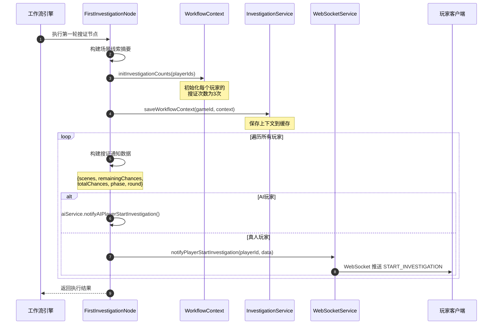
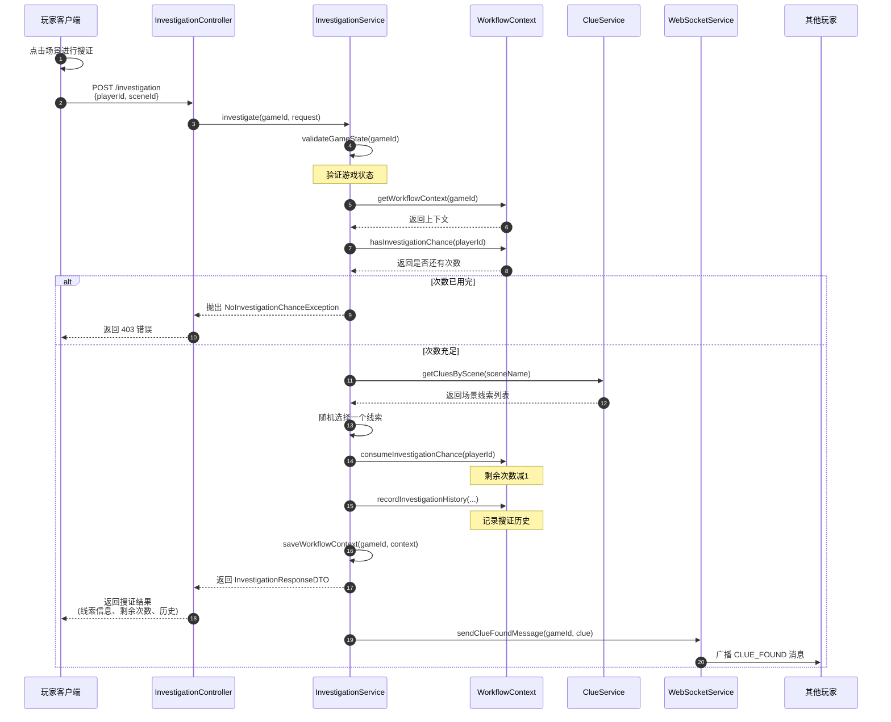
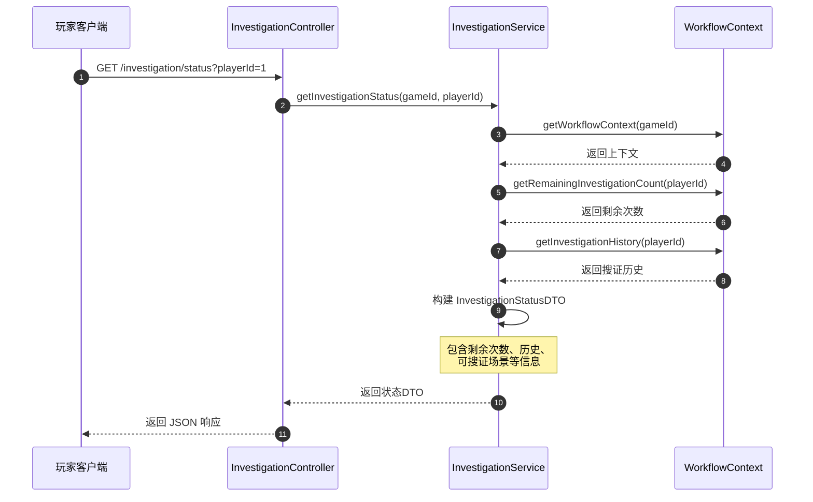

# 搜证系统使用说明

> 文档版本：1.0  
> 作者：ecnu-max  
> 创建日期：2026-02-10  
> 最后更新：2026-02-10

---

## 1. 功能概述

### 1.1 功能简介

搜证系统是 AI 剧本杀游戏的核心玩法之一。在每个搜证阶段，玩家拥有固定的搜证次数（默认为3次），可以点击游戏场景进行搜证，每次搜证消耗一次机会并获得一个线索。

系统特点：

- **次数限制**：每个玩家每轮拥有固定搜证次数，次数用完则无法继续搜证
- **场景关联**：线索与场景绑定，玩家选择场景后随机获得该场景下的一个线索
- **实时同步**：通过 WebSocket 实时推送搜证状态和结果
- **历史记录**：记录玩家的搜证历史，便于回顾和推理

### 1.2 适用场景

- **第一轮搜证**：游戏开始后的第一次搜证阶段
- **第二轮搜证**（预留）：后续可扩展支持多轮搜证
- **DM 管理**：游戏主持人查看所有玩家的搜证状态

### 1.3 相关术语

| 术语   | 说明                      |
|------|-------------------------|
| 搜证   | 玩家消耗一次机会获取线索的操作         |
| 搜证次数 | 玩家在当前轮次剩余的搜证机会，默认为3次    |
| 场景   | 剧本中的地点，包含若干线索           |
| 线索   | 搜证获得的信息，用于推理案情          |
| 搜证阶段 | 游戏流程中的一个阶段，玩家在此期间可以进行搜证 |

---

## 2. 架构设计

### 2.1 核心组件

```
┌─────────────────────────────────────────────────────────────────────┐
│                           搜证系统                                   │
├─────────────────────────────────────────────────────────────────────┤
│  ┌──────────────────┐  ┌──────────────────┐  ┌──────────────────┐  │
│  │ Investigation    │  │ Investigation    │  │ WorkflowContext  │  │
│  │ Controller       │  │ Service          │  │ (状态管理)        │  │
│  │  (控制器层)       │  │  (业务逻辑层)     │  │                  │  │
│  └──────────────────┘  └──────────────────┘  └──────────────────┘  │
│           │                      │                      │          │
│           ▼                      ▼                      ▼          │
│  ┌──────────────────┐  ┌──────────────────┐  ┌──────────────────┐  │
│  │ DTO              │  │ Exception        │  │ WebSocket        │  │
│  │ (数据传输对象)    │  │ (异常处理)        │  │ (实时通知)        │  │
│  └──────────────────┘  └──────────────────┘  └──────────────────┘  │
└─────────────────────────────────────────────────────────────────────┘
```

### 2.2 核心类说明

| 类名                               | 职责              | 关键方法                                                                                    |
|----------------------------------|-----------------|-----------------------------------------------------------------------------------------|
| `InvestigationController`        | 处理搜证相关的 HTTP 请求 | `investigate()`, `getInvestigationStatus()`, `canInvestigate()`                         |
| `InvestigationService`           | 搜证业务逻辑接口        | `investigate()`, `getInvestigationStatus()`, `initInvestigationPhase()`                 |
| `InvestigationServiceImpl`       | 搜证业务逻辑实现        | 实现接口方法，管理搜证次数和历史                                                                        |
| `WorkflowContext`                | 工作流上下文，存储搜证状态   | `initInvestigationCounts()`, `hasInvestigationChance()`, `consumeInvestigationChance()` |
| `FirstInvestigationNode`         | 第一轮搜证工作流节点      | `create()`, 初始化搜证并通知玩家                                                                  |
| `NoInvestigationChanceException` | 搜证次数不足异常        | 自定义业务异常                                                                                 |
| `InvalidInvestigationException`  | 无效搜证操作异常        | 自定义业务异常                                                                                 |

---

## 3. 接口说明

### 3.1 REST API

#### 接口1：执行搜证

- **URL**: `/api/games/{gameId}/investigation`
- **Method**: `POST`
- **Content-Type**: `application/json`

**请求参数**：

| 参数名      | 类型     | 必填 | 说明             |
|----------|--------|----|----------------|
| playerId | Long   | 是  | 玩家ID           |
| sceneId  | Long   | 是  | 要搜证的场景ID       |
| clueId   | Long   | 否  | 指定线索ID（不指定则随机） |
| remark   | String | 否  | 搜证备注           |

**请求示例**：

```json
{
  "playerId": 1,
  "sceneId": 2,
  "remark": "仔细搜查书房"
}
```

**响应参数（成功）**：

| 参数名                  | 类型      | 说明      |
|----------------------|---------|---------|
| success              | Boolean | 是否成功    |
| message              | String  | 响应消息    |
| clue                 | Object  | 获得的线索信息 |
| clue.clueId          | Long    | 线索ID    |
| clue.clueName        | String  | 线索名称    |
| clue.description     | String  | 线索描述    |
| clue.type            | String  | 线索类型    |
| clue.importance      | Integer | 重要度     |
| remainingChances     | Integer | 剩余搜证次数  |
| totalChances         | Integer | 总搜证次数   |
| currentRound         | Integer | 当前轮次    |
| investigateTime      | String  | 搜证时间    |
| investigationHistory | Array   | 搜证历史    |

**响应示例（成功）**：

```json
{
  "success": true,
  "message": "搜证成功",
  "clue": {
    "clueId": 5,
    "clueName": "破碎的花瓶",
    "description": "地上的花瓶碎片，边缘有血迹",
    "type": "PHYSICAL",
    "importance": 8,
    "scene": "客厅"
  },
  "remainingChances": 2,
  "totalChances": 3,
  "currentRound": 1,
  "investigateTime": "2026-02-10T14:30:00",
  "investigationHistory": [
    {
      "sceneId": 2,
      "clueId": 5,
      "clueName": "破碎的花瓶",
      "investigateTime": "2026-02-10T14:30:00"
    }
  ]
}
```

**响应示例（失败-次数已用完）**：

```json
{
  "code": "NO_CHANCE",
  "message": "玩家 1 搜证次数已用完（剩余 0 次）",
  "success": false,
  "data": {
    "playerId": 1,
    "remainingCount": 0
  }
}
```

**错误码**：

| 错误码                   | 说明                   | HTTP状态码 |
|-----------------------|----------------------|---------|
| NO_CHANCE             | 搜证次数已用完              | 403     |
| INVALID_INVESTIGATION | 无效的搜证操作（不在搜证阶段或场景无效） | 400     |
| NOT_FOUND             | 未找到玩家的搜证状态           | 404     |
| INTERNAL_ERROR        | 服务器内部错误              | 500     |

---

#### 接口2：获取搜证状态

- **URL**: `/api/games/{gameId}/investigation/status`
- **Method**: `GET`

**请求参数**：

| 参数名      | 类型   | 必填 | 说明            |
|----------|------|----|---------------|
| playerId | Long | 是  | 玩家ID（Query参数） |

**响应参数**：

| 参数名                  | 类型      | 说明       |
|----------------------|---------|----------|
| playerId             | Long    | 玩家ID     |
| remainingChances     | Integer | 剩余次数     |
| totalChances         | Integer | 总次数      |
| usedChances          | Integer | 已使用次数    |
| currentRound         | Integer | 当前轮次     |
| currentPhase         | String  | 当前游戏阶段   |
| canInvestigate       | Boolean | 是否还可以搜证  |
| investigationHistory | Array   | 搜证历史     |
| availableScenes      | Array   | 可搜证的场景列表 |

---

#### 接口3：检查是否可以搜证

- **URL**: `/api/games/{gameId}/investigation/can-investigate`
- **Method**: `GET`

**请求参数**：

| 参数名      | 类型   | 必填 | 说明            |
|----------|------|----|---------------|
| playerId | Long | 是  | 玩家ID（Query参数） |

**响应示例**：

```json
{
  "canInvestigate": true,
  "gameId": 1,
  "playerId": 1
}
```

---

#### 接口4：获取所有玩家搜证状态（DM用）

- **URL**: `/api/games/{gameId}/investigation/all-status`
- **Method**: `GET`

**说明**：返回游戏中所有玩家的搜证状态，主要用于游戏主持人(DM)查看整体进度。

---

### 3.2 WebSocket 消息

#### 消息类型1：开始搜证通知

- **Type**: `START_INVESTIGATION`
- **Direction**: `Server -> Client`
- **触发时机**：游戏进入搜证阶段时，服务器向所有玩家推送

**消息格式**：

```json
{
  "type": "START_INVESTIGATION",
  "payload": {
    "scenes": [
      {
        "sceneId": 1,
        "sceneName": "客厅",
        "description": "宽敞明亮的客厅",
        "clueCount": 3,
        "clues": [
          {
            "clueId": 1,
            "clueName": "破碎的花瓶",
            "type": "PHYSICAL",
            "importance": 8
          }
        ]
      }
    ],
    "remainingChances": 3,
    "totalChances": 3,
    "phase": "FIRST_INVESTIGATION",
    "round": 1
  }
}
```

**说明**：

- `scenes` 中的 `clues` 只包含线索摘要（名称、类型、重要度），不包含详细描述
- 玩家需要通过搜证 API 获取线索的完整描述

---

#### 消息类型2：发现线索通知

- **Type**: `CLUE_FOUND`
- **Direction**: `Server -> Client`
- **触发时机**：有玩家搜证成功时，向游戏内所有玩家广播

**消息格式**：

```json
{
  "type": "CLUE_FOUND",
  "payload": {
    "clueName": "破碎的花瓶",
    "clueDescription": "地上的花瓶碎片，边缘有血迹"
  }
}
```

---

## 4. 消息时序图

### 4.1 搜证阶段初始化流程



**时序说明**：

1. **步骤1**：工作流引擎执行到第一轮搜证节点
2. **步骤2**：节点构建场景和线索摘要信息（隐藏线索详细描述）
3. **步骤3**：调用 WorkflowContext 初始化所有玩家的搜证次数
4. **步骤4**：InvestigationService 保存工作流上下文到缓存
5. **步骤5-7**：遍历所有玩家，分别发送开始搜证通知
6. **步骤8**：AI 玩家通过 AI 服务通知
7. **步骤9-10**：真人玩家通过 WebSocket 推送通知
8. **步骤11**：节点执行完成，返回结果

---

### 4.2 玩家搜证流程



**时序说明**：

1. **步骤1**：玩家在前端点击场景进行搜证
2. **步骤2**：前端发送 POST 请求到后端
3. **步骤3**：Controller 调用 Service 的 investigate 方法
4. **步骤4**：验证游戏状态是否有效
5. **步骤5-6**：获取工作流上下文
6. **步骤7-8**：检查玩家是否还有剩余搜证次数
7. **步骤9-10**：如果次数已用完，抛出异常返回 403 错误
8. **步骤11-12**：查询场景下的所有线索
9. **步骤13**：随机选择一个线索返回给玩家
10. **步骤14**：扣减玩家的搜证次数
11. **步骤15**：记录本次搜证历史
12. **步骤16**：保存更新后的上下文
13. **步骤17-18**：返回搜证结果给前端
14. **步骤19-20**：通过 WebSocket 向其他玩家广播线索发现消息

---

### 4.3 查询搜证状态流程



**时序说明**：

1. **步骤1**：前端查询玩家的搜证状态
2. **步骤2**：Controller 调用 Service 方法
3. **步骤3-4**：获取工作流上下文
4. **步骤5-6**：获取玩家剩余搜证次数
5. **步骤7-8**：获取玩家搜证历史
6. **步骤9**：构建完整的状态 DTO
7. **步骤10-11**：返回状态信息给前端

---

## 5. 状态流转

### 5.1 玩家搜证次数状态

| 状态    | 说明          | 进入条件          | 退出条件     |
|-------|-------------|---------------|----------|
| 未初始化  | 玩家还没有搜证次数记录 | 初始状态          | 游戏进入搜证阶段 |
| 可搜证   | 玩家剩余次数 > 0  | 初始化完成或扣减后仍有剩余 | 次数扣减至0   |
| 次数已用完 | 玩家剩余次数 = 0  | 搜证次数消耗完毕      | 新一轮搜证开始  |

### 5.2 玩家搜证次数状态流转图

```
                    游戏进入搜证阶段
                           │
                           ▼
    ┌─────────────────────────────────────┐
    │                                     │
    │   ┌──────────┐    搜证成功    ┌──────────┐
    │   │          │ ────────────▶ │          │
    │   │  可搜证   │               │ 可搜证   │
    │   │ (次数>0) │ ◀──────────── │ (次数>0) │
    │   │          │    次数减1    │          │
    │   └──────────┘               └──────────┘
    │          │
    │          │ 次数减至0
    │          ▼
    │   ┌──────────┐
    │   │ 次数用完  │
    │   │ (次数=0) │
    │   └──────────┘
    │          │
    └──────────┘
                 │
                 ▼
           新一轮搜证开始
           (重新初始化次数)
```

---

## 6. 使用示例

### 6.1 前端集成示例

```javascript
// 1. 监听 WebSocket 开始搜证消息
websocket.onMessage((message) => {
    if (message.type === 'START_INVESTIGATION') {
        const {scenes, remainingChances, totalChances} = message.payload;

        // 显示场景列表
        displayScenes(scenes);

        // 更新搜证次数显示
        updateChanceDisplay(remainingChances, totalChances);
    }
});

// 2. 玩家点击场景搜证
async function investigateScene(sceneId) {
    try {
        const response = await fetch(`/api/games/${gameId}/investigation`, {
            method: 'POST',
            headers: {'Content-Type': 'application/json'},
            body: JSON.stringify({
                playerId: currentPlayerId,
                sceneId: sceneId
            })
        });

        const result = await response.json();

        if (result.success) {
            // 显示获得的线索
            displayClue(result.clue);

            // 更新剩余次数
            updateChanceDisplay(result.remainingChances, result.totalChances);

            // 更新搜证历史
            updateInvestigationHistory(result.investigationHistory);
        } else {
            // 显示错误信息
            showError(result.message);
        }
    } catch (error) {
        showError('搜证失败，请重试');
    }
}

// 3. 监听其他玩家发现线索
websocket.onMessage((message) => {
    if (message.type === 'CLUE_FOUND') {
        showNotification(`有玩家发现了线索：${message.payload.clueName}`);
    }
});
```

### 6.2 后端调用示例

```java
// 在游戏服务中初始化搜证阶段
@Service
public class GameService {

    @Autowired
    private InvestigationService investigationService;

    public void startInvestigationPhase(Long gameId) {
        // 获取游戏中的所有玩家
        List<Long> playerIds = getPlayerIdsInGame(gameId);

        // 初始化搜证阶段（每个玩家3次机会）
        investigationService.initInvestigationPhase(gameId, playerIds, 1);

        // 继续执行工作流...
    }
}

// 在控制器中处理搜证请求
@RestController
public class InvestigationController {

    @PostMapping("/api/games/{gameId}/investigation")
    public ResponseEntity<?> investigate(
            @PathVariable Long gameId,
            @RequestBody InvestigationRequestDTO request) {

        try {
            InvestigationResponseDTO response = investigationService.investigate(gameId, request);
            return ResponseEntity.ok(response);
        } catch (NoInvestigationChanceException e) {
            return ResponseEntity.status(HttpStatus.FORBIDDEN)
                    .body(Map.of("error", e.getMessage()));
        }
    }
}
```

---

## 7. 注意事项

### 7.1 性能考虑

- **缓存策略**：`WorkflowContext` 目前存储在内存中的 `ConcurrentHashMap`，生产环境建议使用 Redis 等分布式缓存
- **线索查询**：场景下的线索列表可以添加缓存，减少数据库查询
- **批量操作**：获取所有玩家状态时，避免 N+1 查询问题

### 7.2 安全考虑

- **身份验证**：搜证接口需要验证玩家是否在当前游戏中
- **次数校验**：服务端必须严格校验搜证次数，不能依赖前端传递
- **并发控制**：同一玩家的并发搜证请求需要加锁控制，防止超扣次数

### 7.3 常见问题

**Q1: 玩家刷新页面后搜证次数会重置吗？**
> 不会。搜证次数存储在服务端的工作流上下文中，刷新页面不会影响。

**Q2: 如何支持多轮搜证？**
> 当前架构已预留支持。在 `initInvestigationPhase` 方法中可以传入轮次参数，每轮重新初始化次数。

**Q3: 玩家断线重连后如何恢复状态？**
> 前端可以调用 `GET /investigation/status` 接口重新获取当前状态。

**Q4: 一个场景可以多次搜证吗？**
> 可以。玩家可以多次选择同一个场景，每次都会随机获得该场景下的一个线索（可能重复）。

---

## 8. 相关文档

- [工作流系统说明](./工作流系统说明.md)（待创建）
