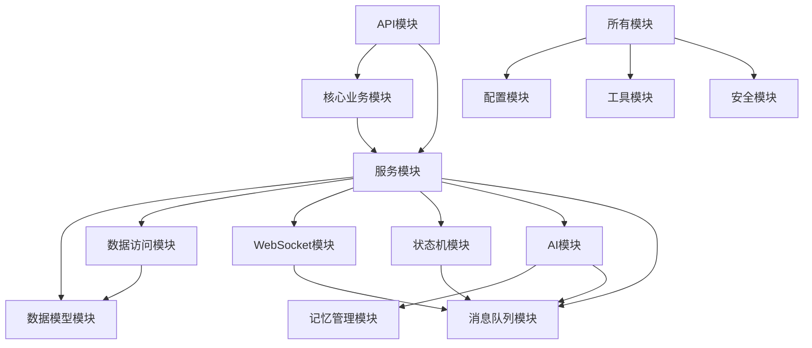

# AI剧本杀项目模块化方案

## 1. 模块架构概述

基于Spring Boot 4.0.2，采用分层架构设计，将系统划分为多个独立模块，实现高内聚、低耦合的架构。

```
ai-jubensha-backend/
├── api/                # API层，处理HTTP请求
├── core/               # 核心业务逻辑层
├── services/           # 服务层，实现具体业务功能
├── models/             # 数据模型层
├── repositories/       # 数据访问层
├── config/             # 配置管理
├── utils/              # 工具类
├── websocket/          # WebSocket实时通信
├── state-machine/      # 状态机管理
├── ai/                 # AI相关功能
├── memory/             # 记忆管理系统
├── message/            # 消息队列
└── security/           # 安全认证
```

## 2. 核心模块设计

### 2.1 API模块 (api/)

**职责**：处理HTTP请求，提供RESTful接口

**子模块**：
- `script-api`：剧本管理接口
- `character-api`：角色管理接口
- `game-api`：游戏管理接口
- `player-api`：玩家管理接口
- `search-api`：搜证系统接口
- `ai-api`：AI交互接口

**技术实现**：
- 使用Spring MVC注解
- 实现请求参数验证
- 统一异常处理
- 集成SpringDoc OpenAPI

### 2.2 核心业务模块 (core/)

**职责**：实现核心业务逻辑

**子模块**：
- `game-core`：游戏流程核心逻辑
- `player-core`：玩家管理核心逻辑
- `script-core`：剧本管理核心逻辑
- `clue-core`：线索管理核心逻辑

**技术实现**：
- 领域驱动设计(DDD)
- 业务规则引擎
- 事件驱动架构

### 2.3 服务模块 (services/)

**职责**：实现具体业务功能

**子模块**：
- `script-service`：剧本管理服务
- `character-service`：角色管理服务
- `game-service`：游戏管理服务
- `player-service`：玩家管理服务
- `clue-service`：线索管理服务
- `scene-service`：场景管理服务
- `vote-service`：投票管理服务

**技术实现**：
- 服务接口定义
- 事务管理
- 服务间调用

### 2.4 数据模型模块 (models/)

**职责**：定义数据实体和DTO

**子模块**：
- `entity`：JPA实体类
- `dto`：数据传输对象
- `vo`：视图对象
- `enums`：枚举类型

**技术实现**：
- 使用Lombok简化代码
- 实现实体关联映射
- 定义数据校验规则

### 2.5 数据访问模块 (repositories/)

**职责**：处理数据持久化

**子模块**：
- `script-repository`：剧本数据访问
- `character-repository`：角色数据访问
- `game-repository`：游戏数据访问
- `player-repository`：玩家数据访问
- `clue-repository`：线索数据访问
- `scene-repository`：场景数据访问

**技术实现**：
- Spring Data JPA
- 自定义查询方法
- 数据过滤和排序

### 2.6 配置模块 (config/)

**职责**：管理系统配置

**子模块**：
- `database-config`：数据库配置
- `redis-config`：Redis配置
- `websocket-config`：WebSocket配置
- `rabbitmq-config`：RabbitMQ配置
- `security-config`：安全配置
- `ai-config`：AI相关配置

**技术实现**：
- Spring Boot配置类
- 环境变量管理
- 配置文件加载

### 2.7 WebSocket模块 (websocket/)

**职责**：实现实时通信

**子模块**：
- `handler`：WebSocket处理器
- `message`：消息模型
- `config`：WebSocket配置
- `service`：WebSocket服务

**技术实现**：
- Spring WebSocket
- STOMP协议
- 消息广播机制

### 2.8 状态机模块 (state-machine/)

**职责**：管理游戏状态

**子模块**：
- `config`：状态机配置
- `event`：状态事件
- `listener`：状态监听器
- `service`：状态管理服务

**技术实现**：
- Spring State Machine
- 状态转换配置
- 事件处理

### 2.9 AI模块 (ai/)

**职责**：实现AI交互功能

**子模块**：
- `agent`：AI Agent实现
- `service`：AI服务
- `prompt`：提示词管理
- `memory`：AI记忆管理
- `decision`：AI决策系统

**技术实现**：
- LangChain4j
- OpenAI API集成
- 多Agent架构

### 2.10 记忆管理模块 (memory/)

**职责**：管理AI记忆

**子模块**：
- `short-term`：短期记忆管理
- `long-term`：长期记忆管理
- `vector`：向量存储管理
- `service`：记忆服务

**技术实现**：
- Redis缓存
- Milvus向量数据库
- 嵌入模型

### 2.11 消息队列模块 (message/)

**职责**：实现异步通信

**子模块**：
- `config`：消息队列配置
- `producer`：消息生产者
- `consumer`：消息消费者
- `service`：消息服务

**技术实现**：
- RabbitMQ
- 消息序列化
- 消费者组

### 2.12 安全模块 (security/)

**职责**：实现认证授权

**子模块**：
- `config`：安全配置
- `filter`：安全过滤器
- `service`：安全服务
- `util`：安全工具

**技术实现**：
- Spring Security
- JWT认证
- 角色权限管理

## 3. 模块间依赖关系



## 4. 关键技术实现

### 4.1 多Agent架构

**实现方案**：
- 使用LangChain4j的Agent API
- 为每个Agent类型创建独立的实现类
- 通过消息队列实现Agent间通信

**核心Agent**：
- `DMAgent`：游戏主持Agent
- `PlayerAgent`：玩家扮演Agent
- `JudgeAgent`：逻辑判断Agent
- `SummaryAgent`：对话摘要Agent

### 4.2 记忆管理系统

**实现方案**：
- 短期记忆：Redis Hash存储最近10-20条对话
- 中期记忆：Redis List存储重要事件
- 长期记忆：Milvus向量数据库存储语义信息

**技术细节**：
- 使用OpenAI Embedding模型生成向量
- 实现相似性搜索算法
- 优化向量存储和检索性能

### 4.3 状态管理

**实现方案**：
- 使用Spring State Machine定义游戏状态
- 实现状态转换规则
- 设计状态事件监听器

**游戏状态**：
- `INTRODUCTION`：介绍阶段
- `SEARCH`：搜证阶段
- `DISCUSSION`：讨论阶段
- `VOTING`：投票阶段
- `ENDING`：结束阶段

### 4.4 实时通信

**实现方案**：
- 使用Spring WebSocket
- 集成STOMP协议
- 实现消息广播机制

**消息类型**：
- `gameState`：游戏状态更新
- `chatMessage`：聊天消息
- `clueFound`：线索发现
- `phaseChange`：阶段转换

## 5. 部署架构

### 5.1 开发环境

- 本地开发：IntelliJ IDEA + Maven
- 数据库：本地MySQL + Redis
- 消息队列：本地RabbitMQ
- 向量存储：本地Milvus

### 5.2 测试环境

- 容器化部署：Docker Compose
- 数据库：MySQL + Redis集群
- 消息队列：RabbitMQ集群
- 向量存储：Milvus集群

### 5.3 生产环境

- 容器编排：Kubernetes
- 服务发现：Consul
- 负载均衡：Nginx
- 监控告警：Prometheus + Grafana

## 6. 扩展性设计

### 6.1 功能扩展

- **剧本系统**：支持自定义剧本上传
- **角色系统**：支持角色技能和特性
- **游戏模式**：支持不同类型的剧本杀模式
- **AI系统**：支持自定义AI人格和行为模式

### 6.2 技术扩展

- **微服务拆分**：将核心服务拆分为独立微服务
- **多语言支持**：国际化和本地化
- **多端支持**：适配移动端和桌面端
- **第三方集成**：社交平台和支付系统集成

## 7. 技术栈总结

| 模块 | 技术 | 版本 |
|------|------|------|
| 后端框架 | Spring Boot | 4.0.2 |
| 数据持久化 | Spring Data JPA | 3.2.0 |
| 数据库 | MySQL | 8.0+ |
| 缓存 | Redis | 7.0+ |
| 实时通信 | Spring WebSocket | 6.0+ |
| 状态管理 | Spring State Machine | 3.2.0 |
| AI框架 | LangChain4j | 0.29.0 |
| 向量存储 | Milvus | 2.3+ |
| 消息队列 | RabbitMQ | 3.12+ |
| 安全框架 | Spring Security | 6.2.0 |
| API文档 | SpringDoc OpenAPI | 2.5.0 |

## 8. 实施建议

1. **按模块顺序实施**：先搭建基础架构，再实现核心功能，最后集成高级特性

2. **优先实现关键路径**：游戏流程管理、实时通信、AI交互是核心功能

3. **注重性能优化**：特别是向量存储和检索的性能

4. **加强测试覆盖**：确保核心功能的稳定性

5. **文档化设计**：为每个模块创建详细的设计文档

6. **代码质量控制**：使用代码审查和静态分析工具

7. **持续集成**：配置CI/CD流程，确保代码质量

通过以上模块化设计，AI剧本杀项目将具有良好的可扩展性、可维护性和性能表现，能够支持复杂的游戏逻辑和AI交互。