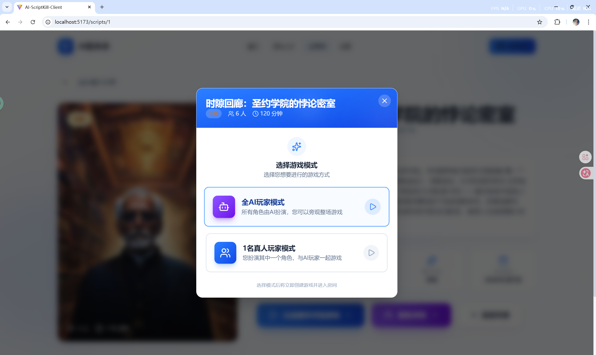
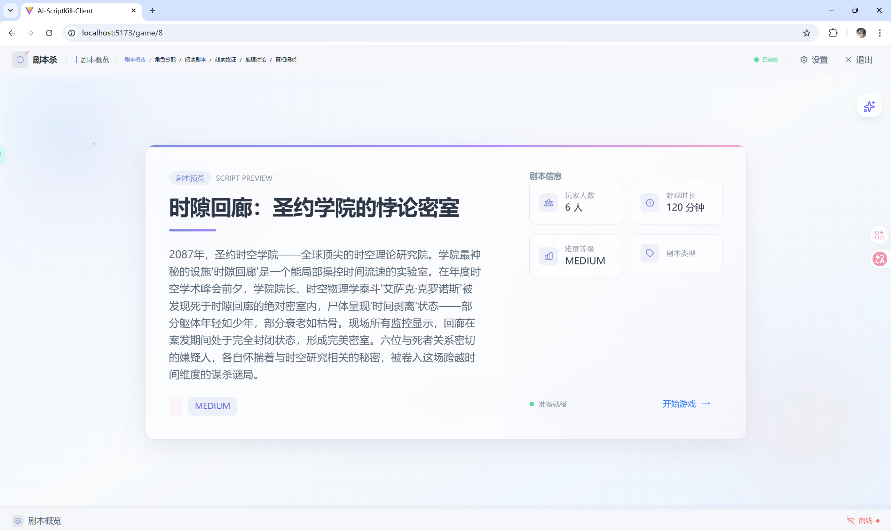
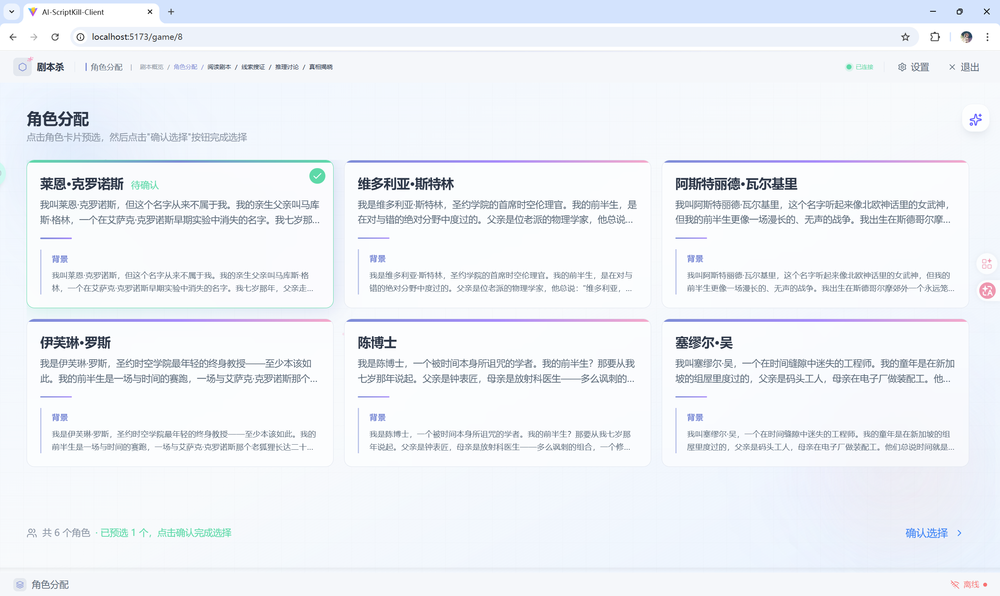
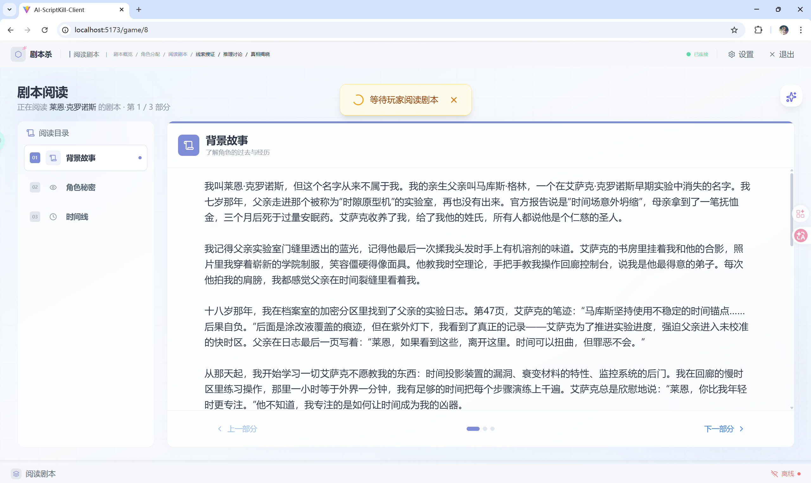
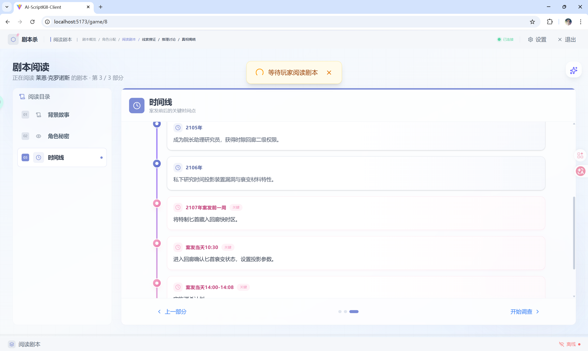
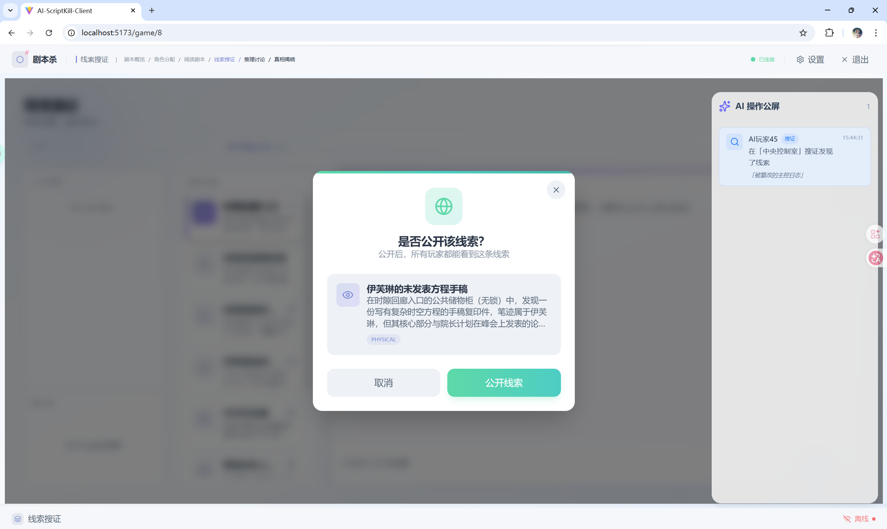
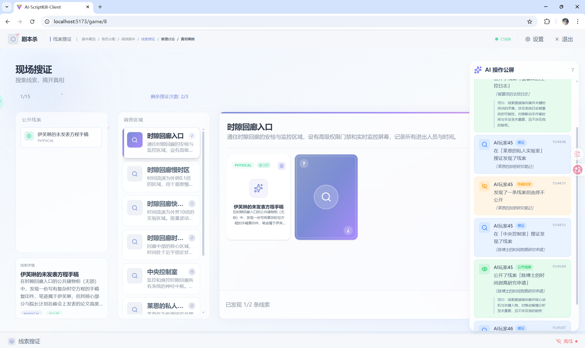
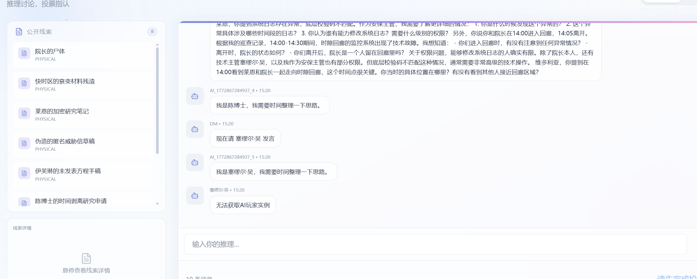
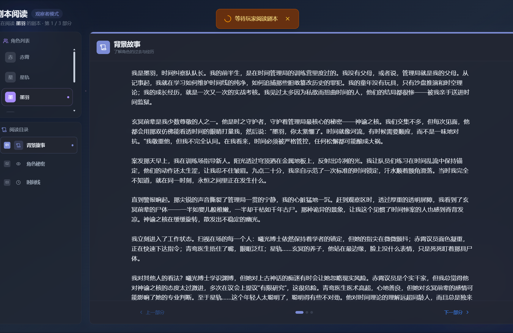

# AI 剧本杀 - 项目功能展示

本文档展示 AI-ScriptKill 项目的核心功能和界面设计。

---

## 一、游戏模式

### 1.1 游戏模式选择

支持 **全 AI 玩家模式** 和 **真人玩家扮演模式**，提供灵活的剧本杀游戏体验。



---

## 二、游戏流程

### 2.1 剧本概述

展示剧本背景故事、难度等级、推荐玩家人数和预计游戏时长等基本信息。



### 2.2 角色选择及分配

支持真人玩家自主选择角色，或由系统自动分配角色。每个角色都有独特的背景故事和秘密任务。



### 2.3 剧本阅读

分角色展示剧本内容，支持多轮次阅读，逐步揭示剧情线索。





---

## 三、搜证系统

### 3.1 线索搜证

真人玩家可在不同场景中进行搜证，获取关键线索。搜证过程实时同步 AI 玩家的搜证结果。



### 3.2 AI 操作公屏

**核心功能**：实时展示 AI Agent 的操作记录和决策过程。

| 操作类型 | 图标  | 说明           |
|------|-----|--------------|
| 搜证   | 🔍  | AI 玩家发现新线索   |
| 公开线索 | 👁️ | AI 玩家选择公开线索  |
| 隐藏线索 | 🚫  | AI 玩家选择不公开线索 |
| 发言   | 💬  | AI 玩家发言或推理   |
| 投票   | ✋   | AI 玩家进行投票    |

**技术实现**：

- WebSocket 消息类型：`AGENT_ACTION`
- 订阅主题：`/topic/game/{gameId}/agent-actions`
- 支持展示 AI 的决策理由（如"选择公开线索因为..."）



---

## 四、讨论阶段

### 4.1 多玩家实时讨论

支持所有玩家（真人和 AI）进行实时讨论、发言和推理。



---

## 五、观察者模式

### 5.1 旁观者视角

支持以观察者身份观看完整游戏流程，无需扮演角色，适合学习游戏规则或观看 AI 之间的推理对决。



---

## 六、技术架构

### 6.1 前端技术栈

- **React 19** - 现代化 UI 框架
- **Vite** - 快速构建工具
- **Tailwind CSS** - 原子化样式框架
- **Framer Motion** - 动画效果库
- **STOMP over SockJS** - 实时通信

### 6.2 后端技术栈

- **Spring Boot 3.2** - Java Web 框架
- **LangChain4J / LangGraph4J** - AI 代理框架
- **DeepSeek API** - 大语言模型服务
- **WebSocket** - 实时消息推送
- **MySQL + Redis** - 数据存储

### 6.3 AI 代理系统

- **DM Agent** - 主持人代理，管理游戏流程
- **Player Agent** - 玩家代理，智能推理和角色扮演
- **Judge Agent** - 裁判代理，评判玩家行为
- **Investigation Agent** - 搜证代理，处理 AI 玩家搜证逻辑

---

## 七、项目结构

```
AI-ScriptKill/
├── ai-jubensha-backend/      # Spring Boot 后端
│   ├── src/main/java/        # Java 源代码
│   │   ├── ai/               # AI 代理模块
│   │   ├── controller/       # API 控制器
│   │   ├── service/          # 业务逻辑层
│   │   └── websocket/        # WebSocket 模块
│   └── src/main/resources/   # 配置文件和 Prompt
│
├── ai-jubensha-frontend/     # React 前端
│   ├── src/
│   │   ├── components/       # UI 组件
│   │   ├── pages/            # 页面组件
│   │   │   └── GameRoom/     # 游戏房间
│   │   ├── hooks/            # 自定义 Hooks
│   │   └── services/         # API 服务
│   └── design/               # 设计文档
│
├── assets/images/            # 项目截图
├── doc/                      # 项目文档
└── reports/                  # 项目报告
```

---

## 八、核心功能特性

1. 🤖 **AI 驱动的游戏体验** - 智能 AI 玩家可以进行推理、搜证、发言和投票
2. 🎮 **灵活的游戏模式** - 支持全 AI 模式、真人模式、混合模式
3. 🔄 **实时状态同步** - WebSocket 实时同步所有玩家操作
4. 🔍 **智能搜证系统** - AI 玩家会自主决定搜证策略和线索公开时机
5. 💬 **公屏展示** - 实时观察 AI 的决策过程和推理逻辑
6. 👁️ **观察者模式** - 支持旁观学习和对战观摩
7. 📱 **响应式设计** - 现代化的玻璃态 UI 设计

---

*文档更新时间：2026年3月8日*
